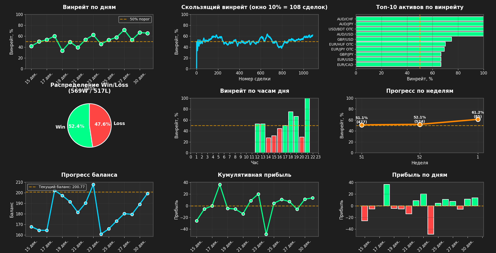
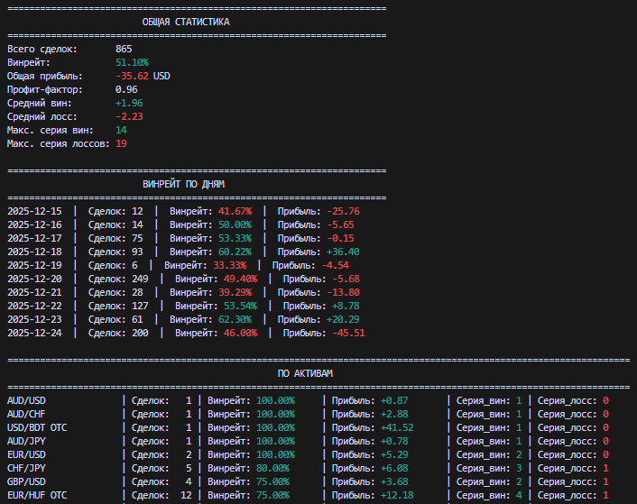

# 📊 Binary Options Winrate Analyzer


**Мощный аналитический инструмент для торговли бинарными опционами на платформе Pocket Option.**  
Отслеживайте свою доходность, анализируйте результаты и улучшайте свои торговые навыки с помощью подробной статистики и наглядных аналитических данных.

---

## Оглавление

- [🎯 Что делает программа?](#-что-делает-программа)
- [📸 Скриншоты](#-скриншоты)
  - [Интерактивные графики](#интерактивные-графики)
  - [Вывод консоли](#вывод-консоли)
- [📥 Как скачать файл со сделками?](#-как-скачать-файл-со-сделками)
- [📂 Куда положить файлы?](#-куда-положить-файлы)
- [🚀 Установка и запуск](#-установка-и-запуск)
- [⚙️ Процесс анализа и фильтры](#️-процесс-анализа-и-фильтры)
- [📊 Что показывает программа?](#-что-показывает-программа)
  - [📋 Консольный вывод](#консольный-вывод)
  - [📈 Графики (9 штук)](#графики-9-штук)
- [💾 Сохранение отчёта](#-сохранение-отчёта)
- [💡 Как использовать результаты?](#-как-использовать-результаты)
- [⚙️ Настройки программы](#️-настройки-программы)
- [📋 Формат файла XLSX](#-формат-файла-xlsx)
- [❓ Частые вопросы](#-частые-вопросы)

---

## 🎯 Что делает программа?

Анализирует ваши сделки и показывает:
- **Винрейт и профит-фактор**
- **Прогресс по дням, неделям и балансу**
- **Лучшие/худшие активы**
- **Оптимальное время торговли**
- **Серии побед и поражений**
- **Кумулятивную прибыль и распределение Win/Loss**

Поддерживает мощные фильтры для глубокого анализа стратегий.

---

## 📸 Скриншоты

### Интерактивные графики



*9 интерактивных графиков: винрейт по дням, скользящее среднее, топ активов, распределение Win/Loss, винрейт по часам, прогресс по неделям, прогресс баланса, кумулятивная прибыль и прибыль по дням*

### Вывод консоли



*Цветная статистика в реальном времени с показателями выигрышей, прибыли/убытков и эффективности*

---

## 📥 Как скачать файл со сделками?

1. Зайдите на Pocket Option: https://pocketoption.com/ru/cabinet/trading-history
2. Выберите период (день/неделя/месяц)
3. Нажмите **"Экспорт"** или **"Download"**
4. Скачайте файл в формате **XLSX**

---

## 📂 Куда положить файлы?

Файлы помещаются в папку `trades`

```
binary-options-winrate-analyzer/
├── main.py                  ← главный скрипт
├── analyzer_config.ini      ← настройки
├── requirements.txt         ← зависимости
├── trades/                  ← положите сюда XLSX-файлы
│   ├── week1.xlsx
│   ├── week2.xlsx
│   └── demo.xlsx
├── outputs/                 ← сюда сохраняются отчёты (MD + PNG)
│   └── _статистика_сохраняется_сюда.txt
└── README.md
```

---

## 🚀 Установка и запуск

### 1. Установите зависимости:

**Вариант 1 (рекомендуется):**
```bash
pip install -r requirements.txt
```

**Вариант 2 (вручную):**
```bash
pip install colorama matplotlib openpyxl pandas python-dateutil requests
```

### 2. Запустите программу:
```bash
python main.py
```

---

## ⚙️ Процесс анализа и фильтры

При запуске программа последовательно предлагает:

1. **Выбор файлов** из папки `trades/` (можно несколько)
2. **Фильтр OTC** (только OTC / только обычные / всё)
3. **Конвертация валют** (автоматически, если в файлах разные валюты)
4. **Ввод текущего баланса**
5. **Фильтр по экспирации** (например, только 60 секунд, Enter = все)
6. **Фильтр по периоду**  
   - От: `ГГГГ.ММ.ДД ЧЧ:ММ` (или только дата/время, Enter = с начала)  
   - До: аналогично (Enter = до текущего момента)  
   - Подтверждение диапазона с возможностью исправить

Затем выводится статистика и открываются графики.

---

## 📊 Что показывает программа?

### Консольный вывод:

#### 1. **ОБЩАЯ СТАТИСТИКА**
```
Всего сделок:       150
Винрейт:            62.67%
Общая прибыль:      +245.50 USD
Профит-фактор:      1.85
Средний вин:        +92.00
Средний лосс:       -100.00
Макс. серия вин:    7
Макс. серия лоссов: 4
```

#### 2. **ВИНРЕЙТ ПО ДНЯМ**
```
Дата        Сделок  Винрейт  Прибыль
2025-01-20    45     60.00    +120.50
2025-01-21    52     65.38    +180.00
2025-01-22    53     62.26    -55.00
```

#### 3. **ПО АКТИВАМ**
```
Актив           Сделок  Винрейт  Прибыль  Макс_вин  Макс_лосс
EUR/USD OTC       25     72.00    +350.00     5         2
GBP/USD OTC       18     55.56    +80.50      3         3
AUD/NZD OTC       12     41.67    -120.00     2         4
```

#### 4. **ПО ЧАСАМ ДЛЯ КАЖДОГО ДНЯ**
```
2025-01-20:
Час   Сделок  Винрейт  Прибыль
10      8      75.00    +120.00
14      12     58.33    +45.50
18      15     53.33    -30.00
```

---

### Графики (9 штук):

#### **1. Винрейт по дням (линия прогресса)**
- Показывает динамику винрейта день за днём
- Зелёная линия — Ваш прогресс
- Оранжевая пунктирная — порог 50%
- **Цель:** линия должна расти вверх!

#### **2. Скользящий винрейт**
- Сглаженная кривая винрейта
- Убирает случайные скачки
- Показывает реальный тренд
- **Цель:** стабильно выше 50%

#### **3. Топ-10 активов по винрейту**
- Горизонтальные бары
- Зелёные (>50%) — хорошие активы
- Красные (<50%) — проблемные активы
- **Цель:** торговать только зелёными!

#### **4. Распределение Win/Loss (пирог)**
- Наглядное соотношение побед/поражений
- Зелёный сектор — Win
- Красный сектор — Loss
- **Цель:** зелёный сектор больше 50%

#### **5. Винрейт по часам дня**
- Столбцы по часам (0-23)
- Зелёные — хорошие часы
- Красные — плохие часы
- **Цель:** торговать в зелёные часы!

#### **6. Прогресс по неделям**
- Оранжевая линия с точками
- Показывает рост винрейта по неделям
- Цифры — винрейт и количество сделок
- **Цель:** линия растёт вверх!

#### **7. Прогресс баланса**
- Показывает изменение баланса по дням
- Голубая линия с точками — ежедневный баланс
- Оранжевая пунктирная — начальный баланс (введите его при запуске программы)
- **Цель:** линия растёт вверх!

#### **8. Кумулятивная прибыль**
- Накопленная прибыль по дням
- Зелёная линия с точками — суммарная прибыль
- Оранжевая пунктирная — нулевая линия
- **Цель:** линия выше нуля!

#### **9. Прибыль по дням**
- Столбцы прибыли за каждый день
- Зелёные — прибыльные дни
- Красные — убыточные дни
- **Цель:** больше зелёных столбцов!

---

## 💾 Сохранение отчёта

После вывода статистики программа спрашивает:

```
💾 Сохранить отчёт (статистика + график)? (да/нет, Enter=нет):
```

- При согласии (или если в конфиге `auto_save = true`) создаются два файла в папке `outputs/`:
  - `ГГГГ-ММ-ДД_ЧЧ-ММ статистика.md` — полная статистика с таблицами
  - `ГГГГ-ММ-ДД_ЧЧ-ММ график.png` — все 9 графиков в одном изображении

Файлы именуются с точным временем анализа для удобного архива.

---

## 💡 Как использовать результаты?

### ✅ Что делать:
1. **Торгуйте активами с винрейтом >60%** (зелёные в графике 3)
2. **Торгуйте в часы с винрейтом >55%** (зелёные в графике 5)
3. **Следите за прогрессом** — линии должны расти (графики 1, 6, 7, 8)
4. **Избегайте активов с винрейтом <45%** (красные в графике 3)

### ❌ Что НЕ делать:
1. Не торгуйте активами с красными барами
2. Не торгуйте в часы с низким винрейтом
3. Не игнорируйте серии лоссов (>5 — сигнал пересмотреть стратегию)

---

## ⚙️ Настройки программы

Все настройки в файле analyzer_config.ini:

- Параметры анализа (окно скользящего винрейта, топ активов)
- Автосохранение отчёта (`auto_save = true/false`)
- Размеры и цвета графиков

### Как изменить:
1. Откройте файл `analyzer_config.ini` в любом текстовом редакторе
2. Измените нужные значения
3. Сохраните файл
4. Запустите программу — изменения применятся автоматически!

**Все настройки с подробными комментариями находятся в файле конфигурации.**

---

## 📋 Формат файла XLSX

Программа ожидает такие колонки:
```
Направление | Сделка | Экспирация | Актив | Время открытия | Время закрытия | Цена открытия | Цена закрытия | Размер сделки | Прибыль | Валюта
```

**Пример:**
```
call | 85a7aa16-... | S60 | EUR/USD OTC | 2025-01-20 15:03:15 | 2025-01-20 15:04:15 | 1.05 | 1.06 | 100 | 92 | USD
```

Это стандартный экспорт из Pocket Option — ничего менять не нужно!

---

## ❓ Частые вопросы

**Q: Программа не находит файлы?**  
A: Убедитесь, что файлы в формате `.xlsx` и лежат в папке `trades/`.

**Q: Ошибка при запуске?**  
A: Установите зависимости: `pip install -r requirements.txt`

**Q: Графики не открываются?**  
A: Проверьте, что matplotlib установлен. Попробуйте: `pip install --upgrade matplotlib`

**Q: Можно анализировать несколько недель/месяцев?**  
A: Да! Загружайте несколько файлов и используйте фильтры по периоду.

**Q: Как сохранить графики вручную?**  
A: В окне графиков нажмите иконку дискеты (или используйте автосохранение).

**Q: Работает ли с другими брокерами?**  
A: Пока только Pocket Option (стандартный формат экспорта).

---
